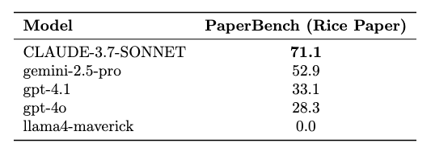
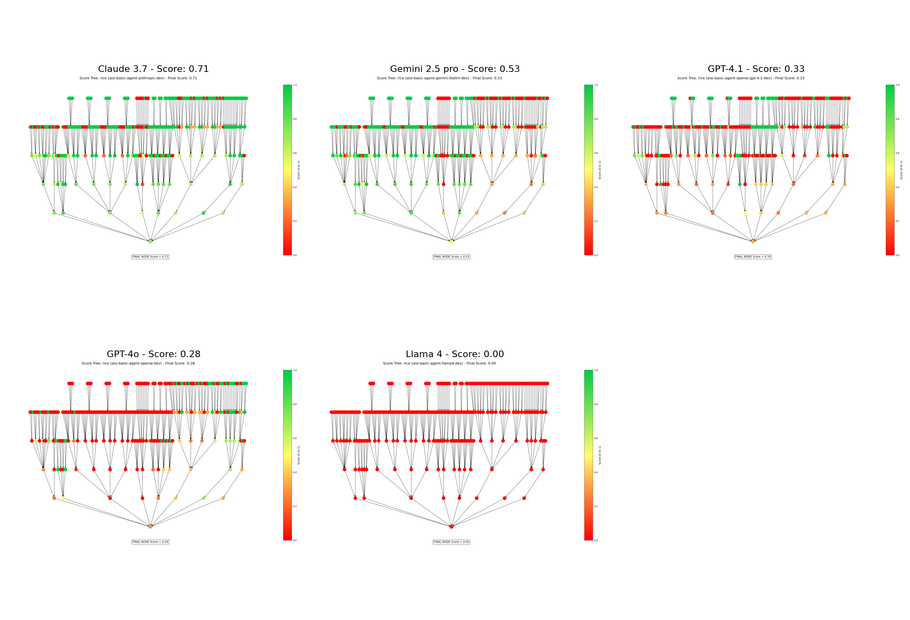

# PaperBench Run Results

This directory contains the results of different AI agent runs attempting to reproduce research papers.

## Results

The `images` directory contains score tree visualizations for different models' performance on the paper reproduction tasks. We ran experiments with the following LLM backends:

- Claude 3.7 (Anthropic)
- GPT-4o (OpenAI)
- GPT-4.1 (OpenAI)
- Llama 4
- Gemini 2.5 pro

### Comparative Analysis

#### Performance

#### Overview Comparison

## Experiments Settings

All runs:
- Used the "code only" version of the agents (no paper content provided)
- Took approximately 3 hours to complete each run
- Were evaluated on their ability to reproduce the Rice paper

The final scores shown in the visualizations are calculated based on a weighted tree structure. Each node in the tree represents a specific task or subtask, with its own score (0-1). The final percentage is computed by aggregating these node scores up the tree, with each parent node's score being a weighted average of its children nodes' scores according to their predefined importance weights.

## Run Contents

Each run directory contains:
1. `group.log` - Contains high-level information about the run execution
2. A subdirectory for each paper being reproduced (e.g., `rice_[uuid]/`)
   - `run.log` - Detailed execution log
   - `pb_result.json` - Evaluation results and metrics

## Evaluation Results

The `pb_result.json` file contains detailed evaluation metrics including:

1. Overall Score (0-1 scale)
2. Task-specific scores for different aspects of the reproduction
3. Detailed explanations for each evaluation criterion
4. Runtime information
5. Error messages (if any)

## Example Metrics

For each paper reproduction attempt, the evaluation includes:
- Code implementation correctness
- Environment setup accuracy
- Algorithm implementation fidelity
- Experimental setup compliance
- Documentation completeness

## Comparing Results

You can compare results across different agents by:
1. Looking at the overall scores in each `pb_result.json`
2. Examining the detailed task breakdowns
3. Comparing runtime performance
4. Reviewing specific implementation details in the evaluation explanations

## Notes

- Scores are on a scale of 0 to 1, where 1 indicates perfect reproduction
- Each evaluation includes detailed explanations of why certain scores were assigned
- The results include both automated and human-judged aspects of the reproduction
- Runtime information helps understand the computational efficiency of different approaches 